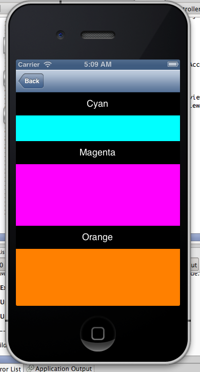

## AccordionView

This AccordionView provides a MonoTouch port of the simple accordion view from https://github.com/appsome/AccordionView

This port is slightly different from the original - I've tweaked some of the scrolling and single/multi open properties.

## Video

http://www.youtube.com/watch?v=ky1_6jOLrZI

## License

This port is licensed MS-PL - see http://opensource.org/licenses/MS-PL

## Developed at CloudZync

CloudZync.com are an exciting UK startup built on a solid business model and leading .Net technologies.

If you are interested in working on mobile projects which will delight UK consumers, then please get in touch

http://cloudzync.com/careers

## Use

The AccordionView is simple to use - see DemoAccordionViewController

Child Views can be added using either:

		public void Add (string text, UIView view)
		public void Add (UIButton header, UIView view)

Selection mode is one of:

		public enum Mode
		{
			SingleSelection,
			SingleSelection_OneAlwaysOpen,
			MultipleSelection
		}

## What's it look like?

## Developer

@slodge at Cirrious Ltd - http://cirrious.com - blogging at http://slodge.blogspot.com

## Thanks

Thanks to CloudZync for allowing this code to be released back to the open source community.

http://cloudzync.com/careers